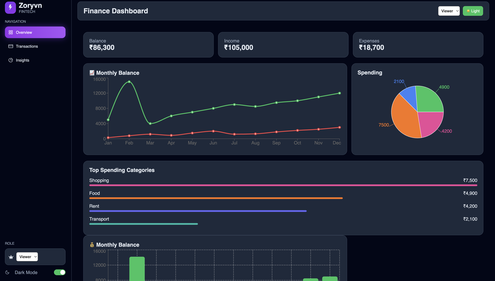
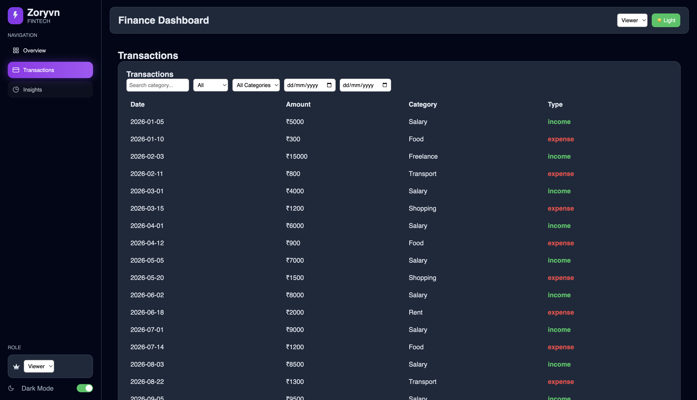
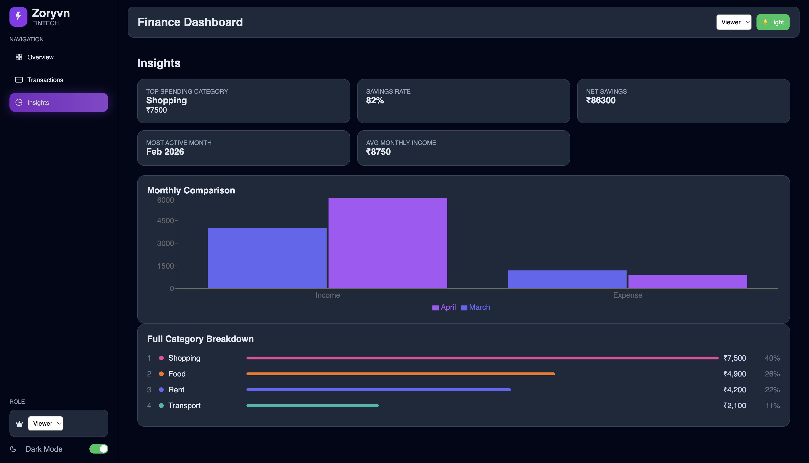
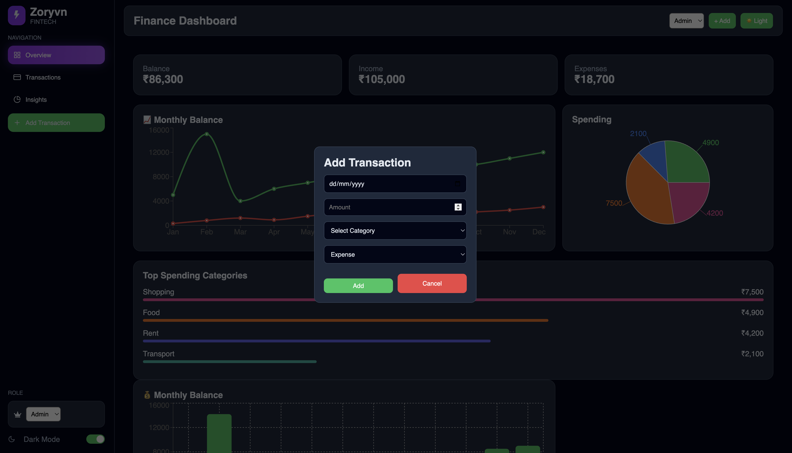

# 📊 Finance Dashboard UI

A modern, responsive **Finance Dashboard** built using **React + TypeScript + Zustand + Recharts**, designed to track financial activities, visualize spending patterns, and provide actionable insights.

---

## 🚀 Features

### 📌 Dashboard Overview

* Total Balance, Income, Expenses cards
* Monthly trend visualization (Line Chart)
* Spending breakdown (Pie Chart)
* Category-wise spending bars

### 💳 Transactions

* View all transactions
* Filter by:

  * Type (Income / Expense)
  * Category
  * Date Range
* Search by category
* Admin can:

  * ➕ Add transaction
  * ✏️ Edit transaction
  * ❌ Delete transaction

### 📈 Insights

* Top spending category
* Savings rate
* Monthly comparison chart
* Full category breakdown with percentage

### 🔐 Role-Based UI

* **Viewer** → Read-only
* **Admin** → Full control (Add/Edit/Delete)

### 🌗 Dark / Light Mode

* Toggle from sidebar
* Fully themed UI using CSS variables

---

## 🧠 Tech Stack

* React (TSX)
* Zustand (State Management)
* Recharts (Charts)
* React Icons
* Custom CSS

---

## 📁 Project Structure

```
src/
├── components/
├── layout/
├── pages/
├── store/
├── styles/
├── App.tsx
└── main.tsx
```

---

## 📸 Screenshots

### 🏠 Dashboard


### 💳 Transactions


### 📊 Insights


### ➕ Add Transaction

---

## ⚙️ Installation

```bash
git clone https://github.com/your-username/finance-dashboard.git
cd finance-dashboard
npm install
npm run dev
```

---

## 🎯 Key Decisions

* Zustand for simple state management
* Component-based architecture
* Global modal system
* CSS variables for theme switching

---

## ⚖️ Trade-offs

| Decision   | Benefit      | Trade-off       |
| ---------- | ------------ | --------------- |
| Zustand    | Simple       | Less structured |
| Custom CSS | Full control | Manual work     |
| Mock Data  | Easy         | No persistence  |

---

## 📈 Future Improvements

* Backend integration
* Authentication
* Data persistence
* Export features
* Animations

---

## 🧑‍💻 Author

Anup S Banakar

---

## ⭐ Note

This project demonstrates modern frontend development with strong UI/UX and state management.
